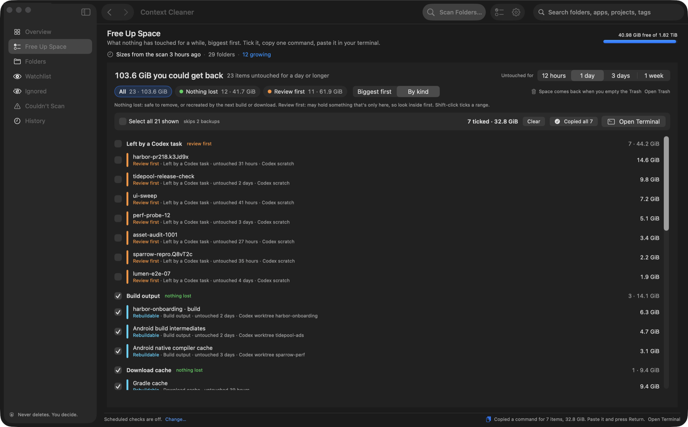
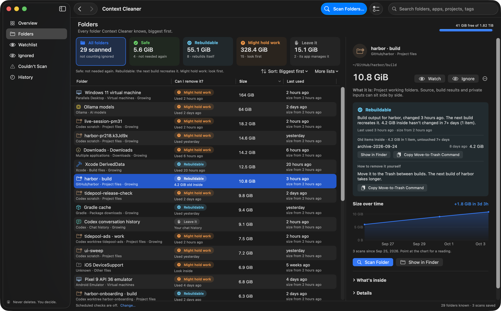
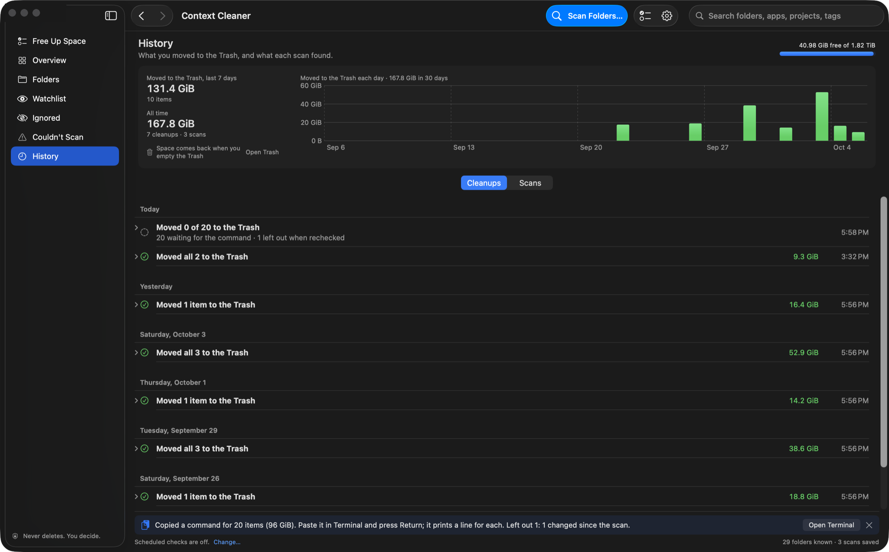

<p align="center">
  
</p>

<h1 align="center">Context Cleaner</h1>

<p align="center">
  <strong>Find the gigabytes that Codex, Xcode and your build tools pile up on your Mac, and clear them in one go.</strong><br>
  A native macOS app. It shows what each folder is and what removing it costs. It never deletes a thing; you do.
</p>

<p align="center">
  <a href="https://github.com/chrissotraidis/contextcleaner/releases/latest"></a>
  
  
  
  
  <a href="LICENSE"></a>
  
  
  
  
  <a href="https://discord.gg/xwHfUD2bxW"></a>
</p>

<p align="center">
  <a href="https://github.com/chrissotraidis/contextcleaner/releases/latest"><b>Download</b></a> ·
  <a href="https://github.com/chrissotraidis/contextcleaner/releases/latest/download/Context-Cleaner-demo.mp4">Watch the 42-second video</a> ·
  <a href="docs/CHANGELOG.md">What's new</a> ·
  <a href="#faq">FAQ</a>
</p>



<sub>Screenshots use made-up demo folders.</sub>

## Why

Coding agents, Xcode, simulators and package managers write a lot to disk and never clean up. On the Mac this was built on, free space fell by 180 GiB in three days. Finder can show what's big, but not what wrote it, whether you still use it, or whether it comes back. Context Cleaner answers those three questions.

## How it works

1. **Scan.** It measures the places where these tools pile up data (sizes and dates only), and reads git, read-only, for project folders.
2. **Answer.** Every folder gets one answer, with the reason and evidence on its card.
3. **Free Up Space.** Pick how long something must have sat untouched, filter to **Nothing lost** or group **By kind**, tick what you want gone, and copy one command (⇧⌘C). Big commands, and any with Review first items, ask once before copying. Folders works the same way: tick folders, copy one command.
4. **You run it.** Paste it in your terminal (Terminal, Ghostty, iTerm and others; the button beside Copy opens the one you pick in Settings). It moves each item to the Trash, prints what happened to each, and Context Cleaner records the cleanup in **History**. Put Back works.

| Answer | What removing it costs |
|---|---|
| 🟢 **Safe to remove** | Nothing. You won't need it again. |
| 🔵 **Rebuildable** | You wait for the next build or download to recreate it. |
| 🟠 **Review first** | It may hold something that exists only there, such as files made by hand or a backup. Look inside first. |
| ⚪ **Not for the Trash** | App libraries and chat history (manage them in their apps), and folders that take no space on this Mac, such as files kept only in iCloud. |

Before copying, every item is checked again: anything gone, open in an app or changed since the scan is left out. A whole Codex worktree is offered only when git has everything in it, and that's checked again too. Backups are never ticked for you, and a command never moves a whole Downloads, `~/GitHub`, virtual machine or chat history.

<table>
  <tr>
    <td width="50%"><br><sub><b>Folders.</b> Every folder, its answer and why. Select All, then copy one command.</sub></td>
    <td width="50%"><br><sub><b>History.</b> What you moved to the Trash, day by day, and what each cleanup left out.</sub></td>
  </tr>
</table>

## Get it

1. Download the DMG from the [latest release](https://github.com/chrissotraidis/contextcleaner/releases/latest) and drag **Context Cleaner** to Applications.
2. It's signed but not notarized. The first time, open it, choose **Done**, then **System Settings › Privacy & Security › Open Anyway**.
3. The first launch shows what a scan reads and never does. Choose **Start Full Scan**; it takes a few minutes. macOS may ask about other apps' data; either answer is fine, it only reads sizes.
4. Open **Free Up Space**, second in the sidebar.

Needs an Apple silicon Mac with macOS 14 or later. On macOS 14 the command uses Finder to move items; on 15 and later it uses macOS's `trash` tool.

<details>
<summary><b>What it looks at</b></summary>

| Group | Places |
|---|---|
| AI tools | Codex worktrees, scratch, backups, tasks and conversations; Claude; Hugging Face; LM Studio; Ollama; DiffusionBee |
| Developer tools | Build folders in `~/GitHub`; Xcode DerivedData and device support; simulators; iPhone install caches; npm, pip, uv, Yarn, Gradle, Homebrew and Playwright caches; your temporary folder |
| Virtual machines | Parallels, Docker Desktop, UTM, Android emulators |
| Games | Steam, CrossOver, OpenEmu |
| Downloads | Your Downloads folder |

Turn any place off in **Settings › Coverage**, or add your own with **File › Add Folder to Scan**. Everything outside these places shows as "Everything else"; open it and it sizes the rest of your home folder, Library and Applications. For Parallels machines and Ollama models, the folder's card shows what's inside: the disk image, snapshots and suspended memory, or each model with the command that removes it.

</details>

<h2 id="faq">FAQ</h2>

<details>
<summary><b>Does it delete anything?</b></summary>

No. There's no delete or clean button. It copies a command for you to paste; nothing moves until you run it, and nothing is gone until you empty the Trash.
</details>

<details>
<summary><b>What does the Move-to-Trash command do?</b></summary>

For each item it prints `Moved`, `Already gone` or `NOT moved` with the reason, then a count. It only counts an item as moved once it's gone. Long selections read their list from a file the app saves, so the command stays one short line.
</details>

<details>
<summary><b>What's the difference between Safe to remove, Rebuildable and Review first?</b></summary>

Safe to remove and Rebuildable lose nothing. Safe to remove means its project is finished or it's sat unused for weeks. Rebuildable means you still use it, so you'll wait for it to be rebuilt. Review first means it may hold something that exists nowhere else, so open it before removing it; once you have, Folders can include it in the same command.
</details>

<details>
<summary><b>How does it know a project is backed up?</b></summary>

It asks git, read-only and offline: a remote, every commit pushed as of your last fetch, nothing uncommitted or stashed. Files git ignores, like `.env`, are named, because git never backs them up.
</details>

<details>
<summary><b>Why does removing a folder free less than its size?</b></summary>

APFS shares storage between copies of files, and space only comes back when you empty the Trash.
</details>

<details>
<summary><b>Does it send my data anywhere?</b></summary>

No. No network code, accounts or analytics. Scans, settings and History are files under `~/Library/Application Support/Context Cleaner`, never rewritten.
</details>

<details>
<summary><b>Is it safe to paste its commands?</b></summary>

Each command checks every item again when you copy it, quotes every name so the shell reads it as text, never moves a link, and stops working after an hour. Git is only ever read, with every setting that could run a program switched off. [SECURITY.md](SECURITY.md) has the details.
</details>

<details>
<summary><b>Can I stop it suggesting a folder?</b></summary>

Right-click it and choose **Ignore This Folder** (still scanned, never suggested) or **Stop Scanning This Folder** (not read at all; its size is the last one seen). Both show under **Ignored**, where **Turn Scanning Back On** undoes the second.
</details>

## Build from source

No dependencies; needs Xcode on Apple silicon.

```sh
git clone https://github.com/chrissotraidis/contextcleaner.git && cd contextcleaner
bash build-version.sh /absolute/path/to/new-output      # app, DMG and SHA-256
bash test-preserving.sh /absolute/path/to/new-tests     # 368 checks, fixtures only
```

More: [changelog](docs/CHANGELOG.md) · [design notes](docs/DESIGN.md) · [validation records](docs/validation)

## Help and license

Questions or bugs: [Discord](https://discord.gg/xwHfUD2bxW) or [open an issue](https://github.com/chrissotraidis/contextcleaner/issues/new/choose). Check screenshots for private paths before posting.

Context Cleaner is free and open source under the [MIT license](LICENSE). It's independent and not affiliated with OpenAI, Apple or any tool it looks at.
