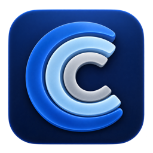
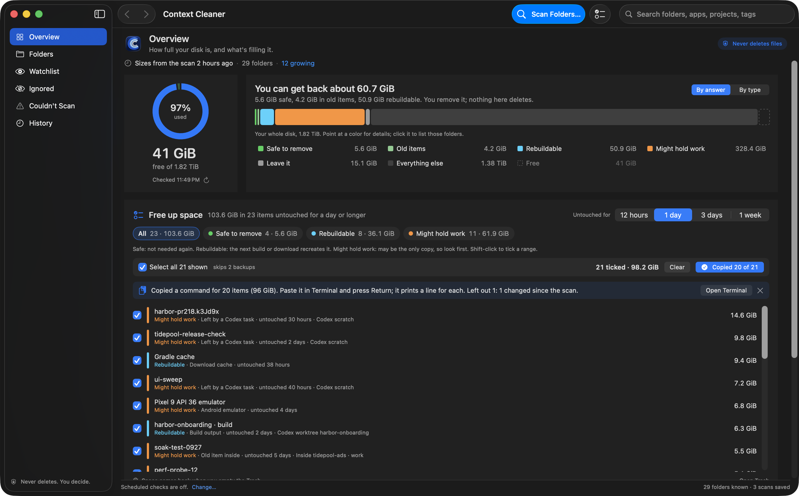
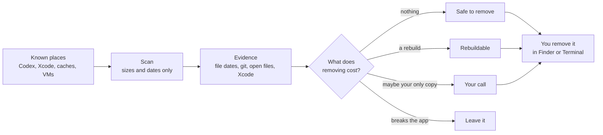

<p align="center">
  
</p>

<h1 align="center">Context Cleaner</h1>

<p align="center">
  <strong>Find the hundreds of gigabytes that Codex, Xcode and your build tools quietly pile up on your Mac.</strong><br>
  A native macOS app that shows where your disk went, what each folder is, what removing it costs, and exactly how to remove it yourself. It never deletes a thing.
</p>

<p align="center">
  <a href="https://github.com/chrissotraidis/contextcleaner/releases/latest"></a>
  
  
  
  
  
  
  <a href="https://discord.gg/xwHfUD2bxW"></a>
</p>

<p align="center">
  <a href="#getting-started">Download</a> ·
  <a href="#how-it-works">How it works</a> ·
  <a href="#can-i-remove-it">Can I remove it?</a> ·
  <a href="#a-tour">Tour</a> ·
  <a href="#frequently-asked-questions">FAQ</a> ·
  <a href="#build-from-source">Build it</a>
</p>



> [!IMPORTANT]
> **Context Cleaner never deletes, moves or empties anything.** It measures folders, explains them, and tells you how to remove them yourself: in Finder, or with a command it copies for you to run. There is no clean button, on purpose.
>
> **Preview build.** The DMG is signed but not notarized, so macOS asks you to confirm the first time you open it. See [Getting started](#getting-started).
>
> **AI disclosure:** Context Cleaner is developed with substantial AI assistance for code, testing, documentation and debugging. The [validation records](docs/validation) state what has actually been checked, and on what.

**Questions or bugs?** Join the [Discord](https://discord.gg/xwHfUD2bxW) or [open an issue](https://github.com/chrissotraidis/contextcleaner/issues).

## What is Context Cleaner?

Coding agents, Xcode, simulators and package managers write a lot to disk, and none of them clean up after themselves. On the Mac this was built on, free space fell by more than 180 GiB in three days. It went into Codex worktrees and recovery copies, dated experiment builds, Android and iPhone build output, install caches, simulators and a Windows VM. Deleting things by hand every day didn't keep up, and Finder's Large Files view couldn't say what wrote a folder, whether it was still in use, or whether it would come back.

Context Cleaner answers those questions for the places where this data piles up, and keeps a history so you can see where the space went.

- **How much can I get back?** One number at the top of the Overview, split by what removing it costs.
- **Where did it go?** This week's change in used space, grouped by place (Codex worktrees, task outputs, simulators), with each folder one click away.
- **Can I remove this?** Every folder gets an answer, a short reason, the evidence behind it, and the steps to remove it yourself.

### At a glance

| | What to expect |
|---|---|
| **Answers** | Safe to remove, Rebuildable, Your call or Leave it, ranked by what removing costs |
| **Evidence** | Newest file change, read-only git status, whether git ignores the folder, open files, and Xcode's own simulator data |
| **Inside folders** | Dated experiment builds and old downloads inside folders you still use, listed with dates and sizes |
| **History** | Disk space every hour while open, folder sizes at every scan, and what grew in between |
| **Coverage** | About 30 known places across AI tools, developer tools, virtual machines, games and Downloads, plus folders you add |
| **Deletes** | Nothing, ever. You remove things, and space comes back when you empty the Trash |
| **Needs** | An Apple silicon Mac with macOS 14 or later |

## What's new

**0.15 makes it easier to know where you are and what everything means:**

- **Back and Forward** (⌘[ and ⌘]) in the toolbar. Open a folder from the Overview, dig into it, and go back to exactly where you were.
- **Every folder card shows its full path** and an **Up to** link to the folder it sits in. Subfolders are named for themselves, such as "project_dex_archive in Android build intermediates".
- **Copy Move-to-Trash Command on every card.** It asks Finder to move the folder, so **Put Back** works and same-named folders don't collide. You run it; Context Cleaner never does.
- **Biggest first** is the default order in Folders.
- **One vocabulary.** **Ignore** is your choice, so the folder is never suggested. **Leave it** is the app's answer for app libraries you manage inside their own apps.
- **How fast it's growing.** Where the space went shows each place's change and its rate per day.
- **A free-space chart** that falls toward "Full" as your disk fills, and a shorter Overview.
- **Everything else, explained.** Click it to see what it is, and **Look Inside** sizes the rest of your home folder, Library and Applications. It's read-only and saves nothing.

**0.14 is a speed release.** Nothing it shows changed, only how fast it gets there:

- **Scans use about 40% less CPU** and finish about 25–35% sooner on big build folders. Each directory is read in batches with one system call instead of one call per file, with identical results.
- **Launch reads your saved history in parallel**: about 0.2 s instead of 0.5 s for 21 scans.
- **The interface does half the work per scan update**, and the Folders table no longer re-sorts on every click.

See the [0.14 validation record](docs/validation/Final%20validation%200.14.0.md) for before and after measurements.

**0.13** made the Overview calmer and clearer:

- **One color system.** Green is safe or freed, soft green is old items, cyan is rebuildable, orange is your call, gray is keep, purple is ignored, blue is used space and growth, and red means a scan couldn't read something. Each color means the same thing everywhere.
- **Where the space went is clickable** and follows the chart: pick 24 hours, 7 days or 30 days, click a day, or drag across a span.
- **Scan History you can read**: each scan's net change, what grew and shrank most, and anything it couldn't read.
- **A calmer Overview**: one Scan button in the toolbar, a shorter Start here list, and Kept renamed **Ignored**.
- **Shorter answers**, and old scans no longer hold their folder listings in memory.

Earlier releases: [0.12](docs/validation/Final%20validation%200.12.0.md) added "You can get back", old experiments inside build folders and the four answers. [0.11](docs/validation/Final%20validation%200.11.0.md) stopped calling recently used caches safe. See [all releases](https://github.com/chrissotraidis/contextcleaner/releases).

## How it works



1. **Scan.** Context Cleaner reads the places where apps are known to pile up data. It records each folder's size, file count and newest change, plus the top level of what's inside. It never opens, changes or deletes a file.
2. **Evidence.** For project folders it reads git, read-only: the last commit, whether the branch is merged, uncommitted changes, whether a worktree is still registered, and whether git ignores the folder. Simulators come from Xcode's own device list. Folders with open files name the app using them.
3. **Answer.** Each folder gets one of four answers, with the reason and the evidence shown on its card.
4. **You decide.** Every card has **Show in Finder** and removal steps. Where it helps, it offers a command to copy, such as `git worktree remove`, `xcrun simctl delete`, or a move-to-Trash command for old items. Context Cleaner never runs them.

## Can I remove it?

| Answer | What removing it costs | Examples |
|---|---|---|
| 🟢 **Safe to remove** | Nothing | Idle package caches, Xcode DerivedData, iPhone install caches, build output from finished projects |
| 🔵 **Rebuildable** | Waiting for the next build or download | Build output and caches you used this week |
| 🟠 **Your call** | It may be the only copy of something | Recovery copies, scratch `work` folders, virtual machines, folders git tracks |
| ⚪ **Leave it** | Breaks the app | Chat history, app libraries |

**Old items inside** are counted on their own. Codex worktrees and project `build`, `generated` and `work` folders keep one subfolder per build or experiment. When one of those folders is still in use, every subfolder untouched for 7 days or more is listed with its date and size (30 days for caches). On the Mac this was built on, that found 205 GiB, including a single 33 GiB experiment build from ten days earlier.

A few rules keep the answers honest:

- **Recent use beats "rebuildable".** A cache used this week is never called safe.
- **Git decides what's build output.** A `build` folder that git tracks may hold source, so it's your call.
- **Finished worktrees say so.** A worktree that's merged, clean and quiet for two weeks offers `git worktree remove`, which git refuses if anything is uncommitted.
- **Simulators are listed by name**, such as "iPhone 17 Pro · iOS 26.5", with size and last use from Xcode.
- **Your choice wins.** Right-click any folder to **Ignore This Folder** (still scanned, never suggested) or **Stop Scanning This Folder**. Both move it to **Ignored**.

## A tour


<sub><b>Where the space went</b> and <b>Start here.</b> Click a place to see which folders grew. The Old items tab lists the folders holding the most untouched builds.</sub>

<table>
  <tr>
    <td width="50%"><br><sub><b>Folders.</b> Biggest unused first. Each card shows the answer, git evidence, old items with dates, and how to remove it.</sub></td>
    <td width="50%"><br><sub><b>Scan History.</b> Each scan's net change, and which folders grew and shrank most.</sub></td>
  </tr>
  <tr>
    <td width="50%"><br><sub><b>Cleanup list.</b> A Markdown checklist with paths and steps, saved on your Mac (⇧⌘E).</sub></td>
    <td width="50%"><br><sub><b>Scan sheet.</b> What it will read, biggest first, and what happens before you start.</sub></td>
  </tr>
  <tr>
    <td width="50%"><br><sub><b>Ignored.</b> Folders you keep out of suggestions or don't scan, with their share of the disk.</sub></td>
    <td width="50%"><br><sub><b>Coverage.</b> Every place it looks, biggest first, each with a switch.</sub></td>
  </tr>
</table>

<p align="center"><br><sub>Light mode follows your Mac, or pick it in Settings (⇧⌘L).</sub></p>

## What it looks at

Context Cleaner reads the places where apps are known to pile up data, plus any folders you add. It isn't a whole-disk scanner, so its totals never equal your used space; the Overview shows the rest as "Everything else".

| Group | Places |
|---|---|
| **AI tools** | Codex worktrees, recovery copies, tasks, conversations and outputs; Claude; Hugging Face; LM Studio |
| **Developer tools** | Build folders in `~/GitHub`; Xcode DerivedData and device support; simulators; iPhone install caches; npm, npx, pip, uv, Yarn, Gradle, Homebrew and Playwright caches |
| **Virtual machines** | Parallels, Docker Desktop's disk, UTM |
| **Games and emulators** | Steam, CrossOver, OpenEmu |
| **Downloads** | Your Downloads folder |

It never looks at system files, other users' folders, Photos, Mail, Messages or iCloud Drive libraries, or Time Machine snapshots. Turn any place off in **Settings › Coverage**.

## Reading the Overview


- **The chart.** Blue is used space; the green band above it is free space, up to the dashed capacity line. The headline is the change in free space for the range you pick. Point at the chart for a reading, click a day to look closer, or drag across a span. **Change per day** switches to bars: blue used more space, green freed it.
- **You can get back.** Safe folders, old items inside folders and rebuildable output added together, each byte counted once. The bar below splits your whole disk by answer; click a color to list those folders.
- **Where the space went.** The chart's range split by place. New folders count in full, and "Outside scanned folders" is everything the app doesn't cover.
- **Start here.** The biggest folders for each answer, with the Trash reminder underneath.

Readings come from every scan and from an hourly check while the app is open. Gaps mean the app wasn't running; nothing is filled in.

## Getting started

1. Download the DMG from [the latest release](https://github.com/chrissotraidis/contextcleaner/releases/latest), open it and drag **Context Cleaner** to Applications.
2. The build is signed but not notarized. Open Context Cleaner, choose **Done** when macOS says it can't verify the app, then go to **System Settings › Privacy & Security** and choose **Open Anyway**. You do this once per version.
3. Choose **Scan Folders…** (⌘R), check the list, and choose **Start Full Scan**. A first scan takes a few minutes, and you can stop at any time.
4. macOS may ask whether Context Cleaner can read other apps' data (such as iPhone install caches) or your Documents folder. The scan waits for your answer. Either way, it only reads sizes and dates.
5. Optional: turn on **Full Disk Access** from **Settings › Scanning**. It stops those questions and lets the app show how much your Trash holds.
6. Start with **You can get back** on the Overview, or the **Old items** tab under **Start here**.

## Frequently asked questions

### Does it delete anything?

No. It has no delete, clean, Trash, uninstall or reset button. It shows you where a folder is and how to remove it, and you decide. Commands it offers are copied for you to run yourself.

### Why is "safe to remove" so much smaller than what I can get back?

Because most big folders on a working Mac are in use. "Safe" means nothing is lost at all. The big wins are usually **old items** inside your build folders and **rebuildable** output from projects you're still working on, which only cost a rebuild. The headline adds all three.

### What does "Your call" mean?

The folder may hold the only copy of something: a Codex recovery copy made before a risky change, a scratch `work` folder with hand-made files, a virtual machine, or a `build` folder git tracks. Each card says what to check first.

### Why does removing a folder free less than its size?

APFS shares storage between copies of files, so some space only comes back when every copy is gone. Space also only comes back after you empty the Trash.

### Does it send my data anywhere?

No. It has no network code, accounts or analytics. Scans, settings and disk readings are saved as files under `~/Library/Application Support/Context Cleaner`. The cleanup list stays on your Mac unless you share it.

### How does it know what a folder is?

From where the folder is, plus evidence. Each place in [What it looks at](#what-it-looks-at) has a known owner and purpose, such as npm's download cache or Xcode's build data. Location suggests which app writes to a folder but doesn't prove it, so the card shows the evidence behind each answer.

### Can I stop it suggesting a folder?

Yes. Right-click it and choose **Ignore This Folder**, or **Stop Scanning This Folder** to leave it out of scans. Both are listed under **Ignored**, with their total.

### Does it run in the background?

Only while it's open. Scheduled checks are off by default; turn them on in **Settings › General**.

## Privacy and your data

Scans read folder sizes, dates and git status only, and never open, change or delete files. Git is always read with optional locks off, so even git's index isn't touched. Every scan, setting and hourly reading is saved as a new file, and nothing is rewritten or pruned.

## Build from source

Requires an Apple silicon Mac with macOS 14 or later and Xcode 27. There are no third-party dependencies.

```sh
git clone https://github.com/chrissotraidis/contextcleaner.git
cd contextcleaner
bash build-version.sh /absolute/path/to/new-build-output
```

The script refuses to overwrite an existing destination. It writes the app, a DMG, its SHA-256, the source revision and the icon it used. It signs with your Apple Development or Developer ID identity if you have one, so macOS remembers your privacy answers across updates; otherwise it signs ad hoc. Set `CC_SIGN_IDENTITY` to choose an identity, or `-` for ad hoc.

### Tests

```sh
bash test-preserving.sh /absolute/path/to/new-test-output
```

Six suites (255 checks) cover preservation, folder contents, scan limits, planning, discovery and model state, and the Overview's numbers. They run on fixtures only, and every fixture and log is kept.

## Documentation

- [Design and copy rules](docs/DESIGN.md)
- [Validation records](docs/validation), one per release, with evidence and limits
- [Goal loops](docs) behind each release, such as [0.13](docs/GOAL_LOOP_0.13.md) and [0.12](docs/GOAL_LOOP_0.12.md)

## Getting help

Join the [Discord](https://discord.gg/xwHfUD2bxW), or [open an issue](https://github.com/chrissotraidis/contextcleaner/issues/new/choose) with your macOS version, the Context Cleaner version (**Context Cleaner › About**), and what you expected to see. Check screenshots and paths for anything private before posting.

## Credits

Built with SwiftUI and Swift Charts, with no third-party code. The folder knowledge comes from how Codex, Xcode, CoreSimulator, CoreDevice, Gradle, npm and the other covered tools lay out their data.

## License

No open-source license has been chosen yet, so the code isn't licensed for reuse. Context Cleaner is an independent project, not affiliated with OpenAI, Apple or any of the tools it looks at.
